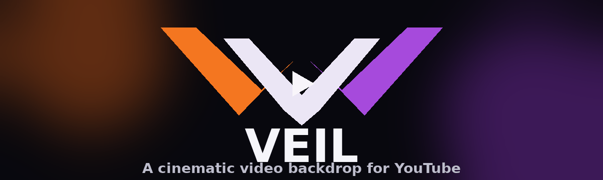

<div align="center">

Veil
A cinematic video backdrop for YouTube.
Turn the currently playing YouTube video into a full-page ambient backdrop while keeping the YouTube player and controls usable above it.
<p>


</p>
</div>
---
✨ What is Veil?
Veil adds a subtle cinematic layer behind YouTube's interface by reusing the currently playing video as a full-page backdrop.
The original YouTube player remains the primary viewing surface, while Veil extends the video's atmosphere across the rest of the page.
The idea
```text
┌──────────────────────────────────────────────────────────────┐
│                    VEIL BACKDROP                             │
│              Current YouTube video                          │
│                                                              │
│        ┌────────────────────────────────────────┐            │
│        │                                        │            │
│        │          YouTube Player                │            │
│        │                                        │            │
│        │   Video + Controls + YouTube UI       │            │
│        │                                        │            │
│        └────────────────────────────────────────┘            │
│                                                              │
│                    Ambient atmosphere                        │
└──────────────────────────────────────────────────────────────┘
```
🎬 Features
Full-page video backdrop — uses the currently playing YouTube video as the backdrop.
Native-feeling player control — enable or disable Veil directly beside YouTube's player controls.
Video switching support — follows YouTube video changes without requiring a page refresh.
YouTube UI stays usable — the backdrop is layered beneath the player interface.
Ambient Mode compatibility — designed to coexist with YouTube's own Ambient Mode.
Lightweight — no external server, account system, analytics, or third-party API.
Local preference — the Veil toggle state is stored locally using Chrome storage.
🧩 How it works
Veil runs as a Chrome content script on YouTube watch pages.
At a high level:
Veil detects the active YouTube `<video>`.
It captures the video's media stream using `captureStream()`.
A separate muted `<video>` element displays that stream as the page backdrop.
The backdrop is positioned beneath YouTube's player/interface layer.
Veil monitors YouTube's dynamic page changes so the backdrop can survive player and video transitions.
No video is uploaded to a Veil server.
🛠️ Tech
JavaScript
Chrome Extensions
Manifest V3
`captureStream()`
`chrome.storage.local`
DOM / MutationObserver-based YouTube integration
📁 Project structure
```text
Veil v1.0/
├── manifest.json
├── content.js
└── icons/
    ├── icon16.png
    ├── icon32.png
    ├── icon48.png
    └── icon128.png
```
🚀 Installation
From source
Download or clone this repository.
Open Chrome and navigate to:
```text
chrome://extensions
```
Enable Developer mode.
Select Load unpacked.
Choose the project folder containing `manifest.json`.
Open a YouTube video.
Use the Veil toggle in the YouTube player controls.
> Veil is currently distributed as a development/source build rather than through the Chrome Web Store.
🔒 Privacy
Veil does not use an external backend, analytics service, or third-party API.
The extension uses Chrome's local storage only for its enable/disable preference and processes the active YouTube video locally in the browser.
📌 Current status
Veil v1.0
The current version focuses on the core experience:
backdrop rendering
video switching
YouTube UI layering
Ambient Mode coexistence
native-style player toggle
local enable/disable state
Further production-readiness and Chrome Web Store preparation can be handled separately.
---
<div align="center">
Veil — let the video become the atmosphere.
</div>
